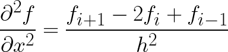
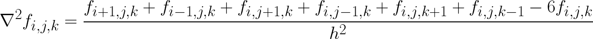

<a id="top"></a>

<h3 align="center">Laplacian equation challenge</h3>

  <p align="center">
    Performance comparison of the 3D Laplacian stencil computation
  </p>
</div>


<!-- ABOUT THE PROJECT -->

## About The Project

The goal is to test multiple implementation of the Laplacian equation, for different programming languages and different libraries, with CPU and GPU, and various compilation options. 

Currently, we implemented:
- Native C++ (CPU)
- C++ with the [Kokkos](https://github.com/kokkos/kokkos) library (CPU and GPU) 
- Python with [Numba](https://github.com/numba/numba) (CPU)
- Python with [Taichi](https://github.com/taichi-dev/taichi) (CPU and GPU)

### Laplacian Equation

The Laplacian operator is defined as the sum of second partial derivatives

<p align="center">

</p>


#### Discretized Form (Finite Difference) 

In 1D, using a grid spacing h: 

<p align="center">

</p>

In 3D, for a regular cubic grid: 

<p align="center">

</p>

<p align="right">(<a href="#top">back to top</a>)</p>

<!-- GETTING STARTED -->

## Installation

Clone the repository

```sh
git clone --recurse-submodules https://github.com/mianbreton/laplacian_challenge.git
```

The C++ and Python tests are independent.

### C++

```sh
# Build native and Kokkos CPU executables
cd cpp/
mkdir -p build/openmp; cd build/openmp
cmake ../../ -DKokkos_ENABLE_OPENMP=ON
make -j $NCPU

# Build Kokkos GPU executables with CUDA
cd cpp/
mkdir -p build/cuda; cd build/cuda
cmake ../../ -DKokkos_ENABLE_OPENMP=ON -DKokkos_ENABLE_CUDA=ON
make -j $NCPU
```

Configuration options ( cmake -D arguments ) include :

```sh
# The following GPU backends are available
DKokkos_ENABLE_CUDA=ON/OFF
DKokkos_ENABLE_HIP=ON/OFF
DKokkos_ENABLE_SYCL=ON/OFF
# Debug, adds the -g compilation flag
-DDEBUG=ON/OFF
# Enable unit testing
-DENABLE_UNIT_TESTING=ON/OFF
```

If unit tests are enabled, run `ctest` in the build directory to test the build.

### Python
To install all the dependencies
```sh
cd python/
python -m pip install -e .
```

> :warning: Currently, it seems that Taichi does not support Python 3.11 and above


### Run

You can run the C++ executables with

```sh
cd cpp/
./run_all.sh
```

To run the Python example

```sh
cd python/
python run.py # Which by defaults runs as 'python run.py --ncells 32 64 128 256 --ncpus 1 2 4 8 16 --runs 10'
```

Both runs will produce runtime files in `./timings/`


<!-- CONTRIBUTING -->

## Contributing

If you with to contribute to this project with other implementations of the Laplacian equation, please fork the repo and create a pull request. You can also simply open an issue with the tag "enhancement".

1. Fork the Project
2. Create your Feature Branch (`git checkout -b feature/AmazingFeature`)
3. Commit your Changes (`git commit -m 'Add some AmazingFeature'`)
4. Push to the Branch (`git push origin feature/AmazingFeature`)
5. Open a Pull Request

<p align="right">(<a href="#top">back to top</a>)</p>

<!-- LICENSE -->

## License

Distributed under the MIT License. See `LICENSE` for more information.

<p align="right">(<a href="#top">back to top</a>)</p>
